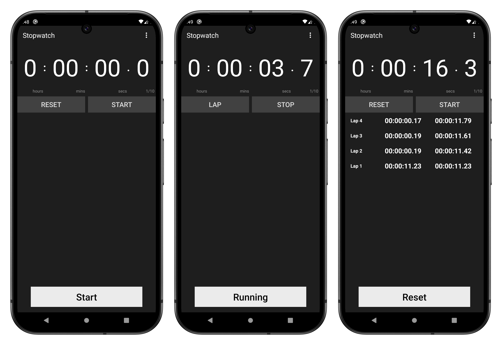

# Chronometer App

## Overview

This project is a **Chronometer App** developed using **MVVM + Clean Architecture**. The chronometer
operates in three states:

1. **Start State**: The chronometer is at `0:00:00.0`, not running, and no laps are registered.
2. **Running State**: The chronometer is running, and the user can register laps.
3. **Reset State**: The chronometer is not running, and either the display is not at `0:00:00.0` or
   laps are registered. The user can reset or restart the chronometer.

## Features

✅ **Lap Logging Behavior**

- **First Lap**: Logs Lap 1 with the partial and total time equal to the chronometer time.
- **Subsequent Laps**: Logs Lap `N`, where:
    - **Partial Time** = Time recorded when pressing the lap button.
    - **Total Time** = `Partial Time (N) + Total Time (N-1)`.

✅ **Analytics Tracking (Firebase Integration)**

- **User Properties**:
    - **Cohort**: Install date in `YYYYMMDD` format.
    - **Usage**: Number of times the user transitions from `Start State → Running State`.
- **Event Tracking**: Logs an event whenever a button is tapped (`Start`, `Lap`, `Stop`, `Resume`).

## Architecture: MVVM + Clean

The app follows **MVVM (Model-View-ViewModel)** and **Clean Architecture** to ensure scalability,
maintainability, and testability.

- **Presentation Layer**:
    - `ChronometerViewModel.java` (Handles UI logic)
    - `ChronometerActivity.java` (View layer)
    - `CustomChronometerView.java` (View layer)
    - `LapsAdapter.java` (RecyclerView Adapter for laps)

- **Domain Layer**:
    - `Lap.java` (Model)
    - `GetLapsUseCase.java` (Encapsulates business logic)
    - `IChronometerRepository.java` (Interface for lap data operations)

- **Data Layer**:
    - `ChronometerRepository.java` (Implements `IChronometerRepository`)
    - `FirebaseAnalyticsHelper.java` (Handles Firebase events)

## Screenshots

  

## Unit Testing

Unit tests are written using **JUnit** and **MockK**:

- To execute Unit tests, use the following command in your Gradle task runner:
  `./gradlew testDebugUnitTest`

## End-to-End Testing

E2E tests are written using **Espresso** and **UI Automator** :

- To execute E2E tests, run the following command using the Gradle task runner:
  `./gradlew app:connectedDebugAndroidTest -i -Pandroid.testInstrumentationRunnerArguments.class=com.chronometer.presentation.ChronometerE2ETest`

## 🧪️ Dependency Injection (Hilt) - **Coming Soon** 🚀

The app will soon integrate **Hilt** for Dependency Injection to improve modularity and testability.

### Benefits of Hilt:

- Reduces boilerplate code.
- Simplifies dependency injection.
- Ensures better separation of concerns.
